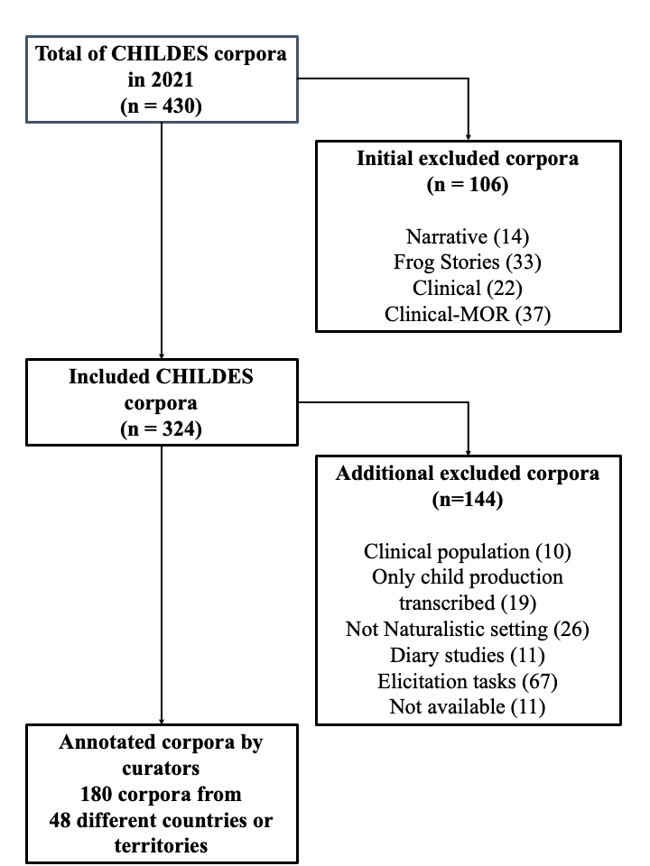

---
title: "Supplementary Materials WEIRD CHILDES"
output:
  pdf_document:
    toc: yes
    toc_depth: 2
    extra_dependencies: ["float"]
  html_document:
    toc: yes
    toc_depth: '2'
    df_print: paged
---

```{r setup, include=FALSE}
knitr::opts_chunk$set(echo = FALSE,warning = FALSE, message = FALSE)

```

```{r libraries, message=FALSE, warning=FALSE}

#Load libraries
library(ggplot2)
library(dplyr)
library(tidyr)
library(purrr)
require(scales)
library(stringr)
library(kableExtra)
library(ggpubr)
library(plotly)
library(GGally)
library(ggthemes)
library(rjson)
library(RColorBrewer)
myPalette <- brewer.pal(5, "Set2") 


group_count <-function(data_, column_){
data_<- data_ %>%
  group_by({{column_}}) %>%
    count() 
      return(data_)
}

group_select<-function(data_, column_){
data_ <- data_%>%
    group_by(!!column_) %>%
      select(Corpus, !!column_)
data_ <- data_[ order( data_[,3] ),]
return(data_)
}

#Load datasets
annotations_inc<- read.csv("../derived/annotations_included", sep="")
ocde <- read.csv("../data/ocde_country.csv", sep=",")
ind<- read.csv("../derived/ind", sep="")
ind_all<- read.csv("../derived/ind_all", sep="")

## for flowchart
annotations<- read.csv("../data/Table for authors - annotations.csv") 
#original link https://docs.google.com/spreadsheets/d/1s-ytfQf7WsZFDDZ6QkOQnZhTodHpQp7D2Wja8YFvjQY/edit?usp=sharing

#some cleaning  of the col names
colnames(annotations)=gsub("\\.\\..*","",colnames(annotations))
colnames(annotations)[colnames(annotations)=="Number.of.participants"]<-"Nb.of.participants"
colnames(annotations)[colnames(annotations)=="Language.or.Languages.spoken.in.recordings..be.specific.if.possible.e.g..French.Quebec."]<-"Language"
colnames(annotations)[colnames(annotations)=="Language.or.Languages.spoken.in.recordings..be.specific.if.possible.e.g..French.Quebec."]<-"Language"
colnames(annotations)[colnames(annotations)=="Location..Neighbourhood..village.city..province..state..country."]<-"Location"
colnames(annotations)[colnames(annotations)=="X..of.children.with.siblings"]<-"Nb.of.children.with.siblings"
colnames(annotations)[colnames(annotations)=="X..of.children.with.older.siblings"]<-"Nb.of.children.with.older.siblings"
colnames(annotations)[colnames(annotations)=="Our.coding.of"]<-"Our.coding.of.community.type"

#Inclusion
annotations$Inclusion[annotations$Inclusion %in% c("No","no")] <- "exclude"
annotations$Inclusion[annotations$Inclusion %in% c("Yes","yes")] <- "include"
#why_exclude
excluded <-  subset(annotations, (Inclusion %in% c("exclude")))

```

## SM1 :Partial correlations of the four dimensions of interest

```{r scatterplot matrix, fig.cap="Evidence of partial correlations of the four continous dimensions of interest. The diagonal shows density of the distribution of each of the variables. Panels below the diagonal show the scatter plot for the two variables involved (e.g., proportion completed highschool and percentage urban for the second row, first column). Those above the diagonal show the Pearson correlation for the two variables involved. Education is represented by proportion of the population completing lower secondary school; industrialization by proportion of the population living in urban (as opposed to rural) sites; richness by GDP per capita.", results='hide'}


p <- ggpairs(ind_all,c('Compl.LS','SP.URB.TOTL.ZS','log_gdp',"Avg.hs"), title="",columnLabels=c("% compl. LSS","% urban","GDP (log 10)", "Avg HH size"), 
               lower = list(continuous = wrap("smooth", alpha = 0.3, size=0.7))) +
  theme_bw()

p
pdf("Fig2.pdf")
p
dev.off()
```

## SM2 Flowchart
{ width=% }


## SM3: Sources used for Density plot

The goal of the country-level analysis is to assess the representativeness of our sub-sample of CHILDES against world statistics. For this, we first identified the country where the recordings were collected. The following variables were used for this level of analysis, all derived from official sources including the World Bank, Our World in Data (WDI), and the United Nations (UN). For each macro-dimension described in the Introduction, we looked for relevant world statistics available (see the annotated code for more details about the indicators). 
SES
For the SES dimension we choose two measures representing education and income. For the education measure, we turned to Our World in Data (WDI), an organization that collates information from various official sources. We downloaded information on the proportion of the population that had completed lower secondary school (data from 2007-2015; Our World in Data, 2022a;  see Supplementary Materials (SMX) for figures using the proportion of the population completing high school instead). For the income measure, we relied on the World Development Indicators (WDI) from the World Bank, available via the WDI package in R (Vincent Arel-Bundock, 2021). We choose the Gross Domestic Product (GDP) per capita (based on log 10), a measure that represents how relatively rich countries are based on 2017 US dollars purchasing power parity. It is expressed in 2017 US dollars. 

Urbanization
We used the percentage of the population living in urban areas indicator, from the WDI from the World Bank. It represents the proportion of the population that was rural, so we estimated the complement to 100% to conceptually align this variable to the others. We employed indicators for the year 2011 because this was the year in which we had the maximum amount of data available for those variables. 
Family structure
We used two measures pertaining to household size from the UN database on Household Size and Composition 2022 (data from 2000-2022 United Nations, 2022). First, the average number of household members, and second, the average number of members under the age of 15. 

```{r tab1,echo = FALSE, as.is=T, ig.pos = "T!",results="asis"}

# Create a data frame
mytab1 <- data.frame(
  Dimension = c("SES", "SES", "Urbanization", "Family structure", "Family structure", "Language"),
  `Macro-level variable` = c("Percent of the population completing lower secondary school*", "GDP per capita (log 10)", "Percent of the population living in urban areas", "Average household size", "Average number of member under 15 in households", "NA"),
  Source = c("Data from 2007-2015; Our World in Data, 2022a", "World Development Indicators (WDI) from the World Bank, available via the WDI package in R (Vincent Arel-Bundock, 2021)", "WDI from the World Bank. It represents the proportion of the population that was rural, so we estimated the complement to 100% to conceptually align this variable to the others. We employed indicators for the year 2011 because this was the year in which we had the maximum amount of data available for those variables.", "UN database on Household Size and Composition 2022 (data from 2000-2022 United Nations, 2022)", "UN database on Household Size and Composition 2022 (data from 2000-2022 United Nations, 2022)", "NA")
)

apa_table(mytab1,caption="", longtable = T, align=c("lccccccccr"))
#write.csv(mytab,"output/table1.csv")
```


## SM4: Distribution of CHILDES participants by country and continent


```{r tab2,echo = FALSE, as.is=T, ig.pos = "T!",results="asis"}
# Create another data frame for the third set of information

corpora.ind <- annotations_inc %>%
  select(country, Corpus, Nb.of.participants, region)

summary_corpora_COUNTRY <- corpora.ind %>%
  group_by(country) %>%
  summarise(
    TimesRepeated = n(),
    TotalParticipants_country = sum(Nb.of.participants)
  )

apa_table(summary_corpora_COUNTRY,caption="Descriptives", longtable = T, align=c("lccccccccr"))

#write.csv(mytab2,"output/table3.csv")
```

```{r tab3,echo = FALSE, as.is=T, ig.pos = "T!",results="asis"}
# Create another data frame for the third set of information

corpora.ind <- annotations_inc %>%
  select(country, Corpus, Nb.of.participants, region)

corpora.ind$region[corpora.ind$country =="Spain & Hungary"] = "Europe"
corpora.ind$region[corpora.ind$country =="Sweden & Portugal"] = "Europe"

summary_corpora_CONT <- corpora.ind %>%
  group_by(region) %>%
  summarise(
    TimesRepeated = n(),
    TotalParticipants_continent = sum(Nb.of.participants)
  )


# sum(annotations$continent=="Africa")
# 
# mytab3 <- data.frame(
#   Continent = c("Africa", "Asia", "North America", "Latin America", "Europe", "Oceania"),
#   `N corpora` = c(3, 32, 34, 5, 105, 1),
#   `N total children` = c(16, 602, 177, 6, 1091, 5),
#   `N children growing in continent` = c("X", "X", "X", "X", "X", "X")
# )
apa_table(summary_corpora_summary_corpora_CONT,caption="Descriptives", longtable = T, align=c("lccccccccr"))

#write.csv(mytab3,"output/table3.csv")
```
## SM5: Table of countries and urban indicators

## SM6: Different languages or language combinations (for bilingual and multilingual children)

## SM7: Number of participants per country

## SM8: Further ackowledgments

We would like to thank the curators of the corpora who replied to our email: Andra Kütt, Caroline Rowland, Carrie Dyck, David Dickinson, Dominique Bassano, Juana Liceras, Klára Matiasovitsová, Luigi Rizzi, Maria João Freitas, Michelle McGillion, Sanne Kuijper, Sinead McNally, Tina Hickey, Ur Shlonsky, Zhang Yibin, Amy Strekas, Donna Thal , Frank Wijnen, Gaja Jarosz, Gerardo Aguado Alonso, Jane Herbert, Jasmina Moskovljević Popović, Jing Zhou, Pilar Prieto, Rebecca Burns, Stephen Matthews, Teresa da Costa, Ulrich Frauenfelder, Uri Tadmor, Virginia Yip, Yvan Rose, Ana Isabel Ojea Lopez, Andra Kütt, Bob Wilson, Christophe Parisse, Elena Lieven, Elena Nicoladis, Elizabeth Nixon, Filip Smolik, Folkert Kuiken, Huang Yue-Yuan, Janet Bang, Jeannine Goh, Julian Pine, Linhui Li, Luigi Rizzi, Maja Roch, Mara Steinberg Lowe, Marguerite Mackenzie, Michelle White, Nada Ševa, Nicola Botting, Stephanie Durrleman, Stephen Matthews, Virginia Yip, Yvan Rose, 404 Not Found, Airi Kapanen, Alan Cruttenden, Alison Henry, Aliyah Morgenstern, Amye Warren-Leubecker, Ana Lúcia Santos, Ana Maria Guimarães, Andra Kütt, Andrea Biró, Andrea Feldman, Angela Grimm, Ann Peters, Anna Chromá, Anna Theakston, Anne Van Kleeck, Anne-Marie Schaerlaekens, Annick De Houwer, Annick DeHouwer, Antje van Oosten, Aparna Nadig, Astrid Klammler, Aurora Bel Gaya, Aviya Hacohen, Ayhan Aksu Koç, Barbara Davis, Barbara Pearson, Bernadette Plunkett, Bernd Möbius, Bob Jones, Brian MacWhinney, Britta Lintfert, Carina Koroschetz, Carmen Silva-Corvalán, Caroline Rowland, Catherine Snow, Cécile De Cat, Charles Watkins, Chiara Roggero, Chien-ju Chang, Christian Champaud, Christiane von Stutterheim, Christina Gildersleeve-Neumann, Christine Howe, Claartje Levelt, Claudine Hammelrath, Colleen Huebner Morisset, Conxita Lleo, Conxita Lleó, Cornelia Hamann, Darinka Anđelković, David Gil, Dmitar Popov, Donella Antelmi, Donna Jackson-Maldonado, Dorit Ravid, Eithne Guilfoyle, Ekaterina Protassova, Elena Pizzuto, Elena Tribushinina, Elena V. M. Lieven, Elisabet Serrat Sellabona, Eliseo Diez-Itza, Elizabeth Bates, Eon-Suk Ko, Eva Bar-Shalom, Eve Clark, Evelien Krikhaar, Feyza Altinkamis, Francisco De Lacerda, Frank Wijnen, Fred Genesee, Frenette Southwood, Gerard Bol, Ghada Khattab, Gina Conti-Ramsden, Gisela Szagun, Giuseppe Cappelli, Gordana Hržica, Gordon Wells, Habibeh Samadi, Hanna Batoréo, Hannah Sarvasy, Harriet Jisa, Heather Goad, Heba Salama, Heidi Feldman, Heike Behrens, Helen Körgesaar, Hervé Hunkeler, Hintat Cheung, Hiro Yuki Nisisawa, Hrafnhildur Ragnarsdóttir, Hye-Ree Ghim, Igor Žagar, Iliana Reyes, Inge Zink, Ioana Goga, Isabelle Barrière, Isabelle Maillochon, Jacqueline Sachs, Jacqueline van Kampen, Jan Edwards, Jane S. Tsay, Javier Aguado Orea, Jean Berko Gleason, Jean Quigley, Jean-Adolphe Rondal, Jeannine Goh, Jeroen Aarssen, Jing Zhou, Jody Tommerdahl, Joe Pater, Johanna Nicholas, Jóhanna Thelma Einarsdóttir, Johanne Paradis, John Neil Bohannon III, Jordan Zlatev, José L. Linaza, Ju-Yeon Ryu, Judit Navracsics, Julian Pine, Julie Brittain, Julie McMillan, Jürgen Weissenborn, Kaja Kohler, Karina Hess Zimmermann, Karme Beek, Katerina Palasis, Katherine Demuth, Katherine Nelson, Kathy Post, Keith Sawyer, Kim Plunkett, Klaus Wagner, L. Haggerty, Laetitia de Almeida, Larisa Avram, Larry F. Guthrie, Leonor Scliar-Cabral, Liliana Tolchinsky, Linda Kelly, Linhui Li, LinHui Li, Lise Menn, Livia Tonelli, Lois Bloom, Lori Van Houten, Lorraine McCune, Lynn S. Bliss, Madalena Cruz-Ferreira, Madeleine Leveillé, Magda Krupa-Kwiatkowska, Magdalena Smoczynska, Maigi Vija, Maja Roch, Manuela Wagner, Marc Bornstein, Margaret Deuchar, Maria del Carmen Aguirre Martínez, Maria Emma Ticio, María Jesús Pérez-Bazán, Maria-Llanos Luque Sánchez, Marie-Thérèse Le Normand, Mariko Hayashi, Marilyn Vihman, Marta Fernández Vázquez, Martha Shiro, Marty Demetras, Mary Ann Evans, Mary Beckman, Mary Erbaugh, Masayuki Yokoyama, Mats Andrén, Max Miller, Megan Devlin, Melanie Soderstrom, Melissa Redford, Melita Kovacevic, Michael Brent, Michael Forrester, Milagros Fernández Pérez, Miquel Serra, Mirco Fasolo, Mireas Llinas, Mireia Llinàs-Grau, Mitsuhiko Ota, Mohamed Lahrouchi, Monique Vion, Myron Korman, Nan Bernstein Ratner, Naomi Hamasaki, Naomi Yamaguchi, Natalia Gagarina, Neil Smith, Neiloufar Family, Nina Gram Garmann, Norio Naka, Not Found, Núria Esteve-Gibert, Oksana Bailleul, Ondene Van Dulm, Oralia Rodríguez Arredondo, Outi Bat-El, Pamela Rollins, Patrick Suppes, Paul Fletcher, Paula Fikkert, Péter Bodor, Petra Bos, Petra Hendriks, Petra Sleeman, Rangaswamy Narasimhan, Raquel Fernández Fuertes, Reili Argus, Richard Sprott, Richard Weist, Roberto Soto Valle, Roger Brown, Ron Gillam, Rosa Graciela Montes, Roy Higginson, Ruth Berman, Sam Leung, Seba Al-Hindawy, Shaima AlQattan, Sharon Inkelas, Silvia Nieva, Silvia Romero Contreras, Sirli Zupping, Sophie Kern, Sotaro Kita, Stan Kuczaj, Steven Gillis, Sudaporn Luksaneeyanawin, Susan Ellis Weismer, Susan Gelman, Susan R. Braunwald, Susana Correia, Susana López Ornat, Susanne Miyata, Sven Strömqvist, Takeo Ishii, Tamirand De Lisser, Tania Ionin, Thea Cameron-Faulkner, Thomas Doukas, Thomas Lee, Tina Ringstad, Twila Tardif, Ursula Stephany, Valentin Remedi, Victoria Marrero, Virginia C. Gathercole, Virginia Gathercole, Virginia Valian, Virginia Yip, William Hall, William Snyder, Xiangjun Deng, Yasuhiro Shirai, Yonata Levy, Yoshiki Ogawa, Yow Wei Quin, and Yow Wei Quin.

# Archive

### Code to reproduce information in the caption to Figure 1

We classified countries as Western and Democratic. For Western, we classified as Western all of the countries in Western Europe (according to EuroVoc: Andorra, Austria, Belgium, France, Germany, Ireland, Liechtenstein, Luxembourg, Monaco, Netherlands, Switzerland, United Kingdom) as well as a few others in Europe (Italy, Portugal, Spain, Norway, Sweden, Iceland, Denmark), most of North America (with the exception of Bermuda and Greenland), and two countries in Oceania (Australia, New Zealand). This resulted in `r sum(ind_all$western == "Western")` Western and `r sum(ind_all$western == "non-Western")` non-Western countries. For democratic, we simplified the OWID's classification of closed and electoral autocracies into autocracies, versus electoral and liberal democracies into democracies (Our World in data, 2022c). 
We had data on political regime for `r sum(!is.na(ind_all$Political.regime_t))` countries (from Our World in Data, OWID, 2011); on the proportion of the population having completed lower secondary school `r sum(!is.na(ind_all$Compl.LS))` (from OWID, 2007-2014); on GDP  for `r sum(!is.na(ind_all$NY.GDP.PCAP.PP.KD))` countries (from WDI, 2011); on the proportion of the population that was urban for `r sum(!is.na(ind_all$SP.URB.TOTL.ZS))` countries (from WDI, 2011); on fertility for `r sum(!is.na(ind_all$Fertility))` countries (from OWID, 2011). 


In this document, we provide code that allows readers to reproduce information provided in the main text that depend on calculations computed here.

## Introduction


### Code to reproduce Figure 1

Note that this Figure appears in a different page.

```{r confounds2, echo=FALSE, out.height="200%", fig.cap="Evidence that values in the multidimensional WEIRD complex are only partially correlated (continued). Violin plots of continuous variables as a function of the two discrete variables: Western and type of political regime. Education is represented by proportion of the population completing lower secondary school; industrialization by percentage of the population living in urban (as opposed to rural) sites; richness by GDP per capita. In addition, we show women's average total fertility.", echo=F,message=F, warning=F, results='hide'}


ed <- ggplot(ind_all[ind_all$Population>10^6 & !is.na(ind_all$Population),], aes(western, Compl.LS)) + geom_violin() + geom_jitter(height = 0, width = 0.1)  +  ylab("% compl. LSS") +
  theme(axis.title.x=element_blank(),
        axis.text.x=element_blank(),
        axis.ticks.x=element_blank())

urb <- ggplot(ind_all[ind_all$Population>10^6 & !is.na(ind_all$Population),], aes(western, SP.URB.TOTL.ZS)) + geom_violin() + geom_jitter(height = 0, width = 0.1)  +  ylab("% urban") +
  theme(axis.title.x=element_blank(),
        axis.text.x=element_blank(),
        axis.ticks.x=element_blank())

rich <- ggplot(ind_all[ind_all$Population>10^6 & !is.na(ind_all$Population),], aes(western, log_gdp)) + geom_violin() + geom_jitter(height = 0, width = 0.1)  +  ylab("GDP (log 10)") +
  theme(axis.title.x=element_blank(),
        axis.text.x=element_blank(),
        axis.ticks.x=element_blank())


fert <- ggplot(ind_all[ind_all$Population>10^6 & !is.na(ind_all$Population),], aes(western, log2_fert)) + geom_violin() + geom_jitter(height = 0, width = 0.1) + xlab("Western") +  ylab("Fert. (log 2)") 


ed_d <- ggplot(ind_all[!is.na(ind_all$Political.regime_t) & ind_all$Population>10^6 & !is.na(ind_all$Population),], aes(Political.regime_t, Compl.LS)) + geom_violin() + geom_jitter(height = 0, width = 0.1)  +
  theme(axis.title.x=element_blank(),
        axis.text.x=element_blank(),
        axis.ticks.x=element_blank(),axis.title.y=element_blank(),
        axis.text.y=element_blank(),
        axis.ticks.y=element_blank())

urb_d <- ggplot(ind_all[!is.na(ind_all$Political.regime_t)& ind_all$Population>10^6 & !is.na(ind_all$Population),], aes(Political.regime_t, SP.URB.TOTL.ZS)) + geom_violin() + geom_jitter(height = 0, width = 0.1)  +
  theme(axis.title.x=element_blank(),
        axis.text.x=element_blank(),
        axis.ticks.x=element_blank(),axis.title.y=element_blank(),
        axis.text.y=element_blank(),
        axis.ticks.y=element_blank())

rich_d <- ggplot(ind_all[!is.na(ind_all$Political.regime_t)& ind_all$Population>10^6 & !is.na(ind_all$Population),], aes(Political.regime_t, log_gdp)) + geom_violin() + geom_jitter(height = 0, width = 0.1)   +
  theme(axis.title.x=element_blank(),
        axis.text.x=element_blank(),
        axis.ticks.x=element_blank(),axis.title.y=element_blank(),
        axis.text.y=element_blank(),
        axis.ticks.y=element_blank())


fert_d <- ggplot(ind_all[!is.na(ind_all$Political.regime_t)& ind_all$Population>10^6 & !is.na(ind_all$Population),], aes(Political.regime_t, log2_fert)) + geom_violin() + geom_jitter(height = 0, width = 0.1) + xlab("Political regime") +
  theme(axis.title.y=element_blank(),
        axis.text.y=element_blank(),
        axis.ticks.y=element_blank())

x = ggarrange( ed, ed_d,  rich,rich_d,   
          urb, urb_d,   fert, fert_d,
           ncol = 2, nrow = 4)
x
pdf("Fig1.pdf")
x
dev.off()
```


### Code to reproduce information in the caption to Figure 1

We classified countries as Western and Democratic. For Western, we classified as Western all of the countries in Western Europe (according to EuroVoc: Andorra, Austria, Belgium, France, Germany, Ireland, Liechtenstein, Luxembourg, Monaco, Netherlands, Switzerland, United Kingdom) as well as a few others in Europe (Italy, Portugal, Spain, Norway, Sweden, Iceland, Denmark), most of North America (with the exception of Bermuda and Greenland), and two countries in Oceania (Australia, New Zealand). This resulted in `r sum(ind_all$western == "Western")` Western and `r sum(ind_all$western == "non-Western")` non-Western countries. For democratic, we simplified the OWID's classification of closed and electoral autocracies into autocracies, versus electoral and liberal democracies into democracies (Our World in data, 2022c). 
We had data on political regime for `r sum(!is.na(ind_all$Political.regime_t))` countries (from Our World in Data, OWID, 2011); on the proportion of the population having completed lower secondary school `r sum(!is.na(ind_all$Compl.LS))` (from OWID, 2007-2014); on GDP  for `r sum(!is.na(ind_all$NY.GDP.PCAP.PP.KD))` countries (from WDI, 2011); on the proportion of the population that was urban for `r sum(!is.na(ind_all$SP.URB.TOTL.ZS))` countries (from WDI, 2011); on fertility for `r sum(!is.na(ind_all$Fertility))` countries (from OWID, 2011). 


### Code to reproduce text on p. 13

The answer to the question of who surrounds the child may also depend on how large the nuclear family is. There is considerable cross-population variation in terms of the average number of children a woman has in her reproductive lifetime, varying between a little over 1 (`r paste0(ind_all[which(ind_all$Fertility==min(ind_all$Fertility,na.rm=T)),"Fertility"],", ",ind_all[which(ind_all$Fertility==min(ind_all$Fertility,na.rm=T)),"country"])`) to over 6 (`r paste0(ind_all[which(ind_all$Fertility==max(ind_all$Fertility,na.rm=T)),"Fertility"],", ",ind_all[which(ind_all$Fertility==max(ind_all$Fertility,na.rm=T)),"country"])`). 

```{r}
#https://submissions2.mirasmart.com/Verify/PAA2021/Submission/Temp/radd1gjhtkk.pdf
#data extracted from fig 6
x<-read.csv("arg2010pcwch.txt",sep="\t")
x$tfr<-(x$X1+x$X2*2+x$X3*3+x$X4*4)/100
```


## Methods

### Code to reproduce text on p. 16

A total of `r nrow(annotations)` corpora were initially considered. We excluded  `r excluded["Clinical"]` because at least some of the children were not typically developing;  `r excl["In lab/school"]` because data was collected in the lab or school; `r excl["Not available"]` because data was not available; `r excl["Only child transcribed"]` because only the child was transcribed; `r excl["Diary"]` because they were diary studies; `r excl["Task-oriented"]` because speech was triggered by a task (elicitation, story-telling, etc.); `r excl["Unfamiliar adult"]` because the conversation involved exclusively unfamiliar adults. After these exclusions, `r nrow(annotations)` remained. The following analyses will continue only on these included corpora.


### Code to reproduce information on Table 2

```{r tab2, eval=F}

colSums(!is.na(annotations[,c("country","Compl.LS","SP.URB.TOTL.ZS","log_gdp","log2_fert")]))


```

### Code to reproduce information on Table 3

```{r tab3, eval=F}
colSums(!is.na(annotations[,c("Education.STDZD","SES.STDZD","Parental.profession","Language.or.Languages.spoken.in.recordings","Bilingualism.Multilingualism.in.corpus",
                    "Type.of.community.at.the.time.of.the.recordings", "Household.structure","Proportion.With.Siblings","Average.number.of.siblings")]))

```


## Results

### Code to reproduce text on p. 20


The samples are varied in geographic terms, with corpora for every populated continent. Specifically, `r sum(annotations$continent=="Africa")` corpora were collected in Africa; `r sum(annotations$continent=="Asia")` in Asia; `r sum(annotations$continent=="Western Europe")` in Western Europe, and a further `r sum(annotations$continent=="Non-Western Europe")` in Non-Western Europe; `r sum(annotations$continent=="North America")` in North America and `r sum(annotations$continent=="Western Europe")` in Latin America. Only `r sum(annotations$continent=="Oceania")` was collected in Oceania.

### Code to reproduce Figure 3
Note that this Figure appears in a different page.

```{r figcomp, fig.cap="Figure 3: Density plots showing the distribution of country-level descriptors for all countries (dark gray) versus countries represented in CHILDES (orange). GDP stands for Gross Domestic Product. Percent completed lower secondary school is the percent of the country's population completing lower secondary school. Percent urban is the percent of the country's population residing in urban (as opposed to rural) locations. Total fertility rate is the average number of children a woman has over her whole reproductive period.", results='hide'}


#  rich
dens_dat=data.frame(rbind(cbind(ind_all$log_gdp[!is.na(ind_all$log_gdp)],0),
               cbind(ind$log_gdp[!is.na(ind$log_gdp)],1) ))
colnames(dens_dat)<-c("GDP.per.capita","in.childes_T")
dens_dat$in.childes=ifelse(dens_dat$in.childes,"CHILDES","all")
gdpt = t.test(dens_dat[,1]~dens_dat$in.childes)

rich <- ggplot(dens_dat, aes(x = GDP.per.capita, fill = in.childes)) + geom_density(alpha = 0.5) + theme(legend.position = "none", axis.title.y=element_blank() ) +labs( x = "GDP per capita (log 10)")+ scale_fill_colorblind()


#Educated
dens_dat=data.frame(rbind(cbind(ind_all$Compl.LS[!is.na(ind_all$Compl.LS)],0),
               cbind(ind$Compl.LS[!is.na(ind$Compl.LS)],1) ))
colnames(dens_dat)<-c("completed.LSS","in.childes_T")
dens_dat$in.childes=ifelse(dens_dat$in.childes,"CHILDES","all")
edt = t.test(dens_dat[,1]~dens_dat$in.childes)

ed <- ggplot(dens_dat, aes(x = completed.LSS, fill = in.childes)) + geom_density(alpha = 0.5) + theme(legend.position = c(0.25, 0.8), axis.title.y=element_blank() , legend.title = element_blank())+labs( x = "% compl. LSS")+ scale_fill_colorblind()


#urban
dens_dat=data.frame(rbind(cbind(ind_all$SP.URB.TOTL.ZS[!is.na(ind_all$SP.URB.TOTL.ZS)],0),
               cbind(ind$SP.URB.TOTL.ZS[!is.na(ind$SP.URB.TOTL.ZS)],1) ))
colnames(dens_dat)<-c("pc.urban","in.childes_T")
dens_dat$in.childes=ifelse(dens_dat$in.childes,"CHILDES","all")
urbt = t.test(dens_dat[,1]~dens_dat$in.childes)

urb <- ggplot(dens_dat, aes(x = pc.urban, fill = in.childes)) + geom_density(alpha = 0.5) + theme(legend.position = "none", axis.title.y=element_blank() )+labs( x = "% urban")+ scale_fill_colorblind()

#Fertility
dens_dat=data.frame(rbind(cbind(ind_all$log2_fert[!is.na(ind_all$log2_fert)],0),
               cbind(ind$log2_fert[!is.na(ind$log2_fert)],1) ))
colnames(dens_dat)<-c("N.children.woman","in.childes_T")
dens_dat$in.childes=ifelse(dens_dat$in.childes,"CHILDES","all")
fertt = t.test(dens_dat[,1]~dens_dat$in.childes)

fert <- ggplot(dens_dat, aes(x = N.children.woman, fill = in.childes)) + geom_density(alpha = 0.5)+ theme(legend.position = "none", axis.title.y=element_blank() ) +labs( x = "Fertility (log 2)")+ scale_fill_colorblind()

# combined

#W E I R D
x <- ggarrange(ed, urb, rich, fert,  
          labels = c("A", "B", "C", "D"),
          ncol = 2, nrow = 2)
x
pdf("Fig3.pdf")
x
dev.off()
```


### Code to reproduce text on p. 20

Using country-level statistics, we were able to assess the extent to which the countries with data in CHILDES were a representative sample of countries in the world. Density plots are portrayed in Figure 3. The means for each of the variables differed for the countries in CHILDES versus overall in the world using unpaired samples t-tests without assuming equality of variance (Welch's t). Countries in CHILDES had a higher proportion of the population completing lower secondary school than the world wide sample (% compl. LSS, t(`r round(edt$parameter,2)`)=`r round(edt$statistic,2)`, p = `r round(edt$p.value,2)`); they were more urban (% urban, t(`r round(urbt$parameter,2)`)=`r round(urbt$statistic,2)`, p = `r round(urbt$p.value,2)`);  richer (log GDP per capita, t(`r round(gdpt$parameter,2)`)=`r round(gdpt$statistic,2)`, p = `r round(gdpt$p.value,2)`) and had lower fertility rates (log fertility, t(`r round(fertt$parameter,2)`)=`r round(fertt$statistic,2)`, p = `r round(fertt$p.value,2)`).

### Code to reproduce text on p. 22


Education information was missing for more than half of the corpora (see Table 3); and `r sum(annotations$Education.STDZD=="diverse",na.rm=T)` were described as diverse, without clarifying the range of education covered. Of the remaining `r sum(!is.na(annotations$Education.min))` samples, `r sum(annotations$Education.min==1 & !is.na(annotations$Education.min))` had at least some parents with primary-level education;  `r sum(annotations$Education.min==2 & !is.na(annotations$Education.min))` had parents with secondary school education as the lower bound of the education range, and a further `r sum(annotations$Education.min==3 & !is.na(annotations$Education.min))` had some college as the lower bound. Thus, `r round(sum(annotations$Education.min>3 & !is.na(annotations$Education.min))/sum(!is.na(annotations$Education.min))*100)`% of the samples (N = `r sum(annotations$Education.min>3 & !is.na(annotations$Education.min))`) portrayed children whose parents had at least a graduate, if not a postgraduate, degree. Samples were not representative of the countries they were collected, since in those same countries the proportion of the population with tertiary education was only `r round(mean(annotations$College, na.rm=T))`%.


For socioeconomic status, there were `r sum(is.na(annotations$SES.STDZD))` missing values (`r round(sum(is.na(annotations$SES.STDZD))/length(annotations$SES.STDZD)*100)`%). Of the remaining `r sum(!is.na(annotations$SES.STDZD))` samples, `r sum(annotations$SES.STDZD==1 & !is.na(annotations$SES.STDZD))` were described as having low SES; `r sum(annotations$SES.STDZD=="1-2" & !is.na(annotations$SES.STDZD))` were described as spanning both lower and middle or higher SES; and `r sum(annotations$SES.STDZD==2 & !is.na(annotations$SES.STDZD))` were described as middle or higher SES exclusively. Given that most countries represented in CHILDES are in the Organization for Economic Cooperation and Development (OECD, `r sum(annotations$oecd)` out of the `r dim(annotations)[1]` corpora), we can compare this proportion with the proportion of the population in these countries that are middle class. According to a 2016 report, “Almost two-thirds of people live in middle-income households in OECD countries”, for whom “household net income [is] between 0.75 and 2 times the median”. Thus, middle and higher class participants appear to be over-represented in CHILDES data, composing 81% of available data.

<!-- https://www.oecd.org/inclusive-growth/about/centre-for-opportunity-and-equality/Issues-note-Middle-Class-squeeze.pdf -->

Information about parents’ profession or activity was also missing for the majority of the corpora (see Table 3). Professions were overall varied, but it should be noted that `r round(sum(annotations$is.academic=="yes" & !is.na(annotations$is.academic))/sum(!is.na(annotations$Parental.profession))*100)`% of the samples contained parents who were described as (Masters or PhD) students, professors, linguists, researchers, scientists, or academics. To give an idea of the extent to which this is not representative, consider the fact that in 2020, `r round((47000 +135000+20000000+3000000)/392000000*100)`% of the American population would be included in that list of professions. Similar data is hard to find for all countries represented in CHILDES, but we suspect that the proportion of scientists, professors, Masters and PhD students found in most other countries will be the same or lower.

<!-- in 2020, 47,000 people were scientists in the USA (including both in academia and the private sector), 135,000 were professors, 20 million were Masters students, and 3 million were PhD students. Given that the USA’s population is 392 million, -->


Only about a third of the samples had information about whether the community was rural or urban (see Table 3), and the remaining ones were very homogeneous. Setting aside  `r sum(is.na(annotations$Type.of.community.at.the.time.of.the.recordings))` missing values (`r round(sum(is.na(annotations$Type.of.community.at.the.time.of.the.recordings))/length(annotations$Type.of.community.at.the.time.of.the.recordings)*100)`%), and focusing on the remaining `r sum(!is.na(annotations$Type.of.community.at.the.time.of.the.recordings))` samples, `r sum(annotations$Type.of.community.at.the.time.of.the.recordings=="urban" & !is.na(annotations$Type.of.community.at.the.time.of.the.recordings))` were described as industrialized or urban, and an additional one as both rural and urban. Only `r sum(annotations$Type.of.community.at.the.time.of.the.recordings!="urban" & !is.na(annotations$Type.of.community.at.the.time.of.the.recordings))` samples were described as farming or rural. In these same countries, the proportion of the population residing in urban settings was `r round(mean(annotations$SP.URB.TOTL.ZS, na.rm=T))`%, suggesting that samples were not representative of their countries in terms of rural versus urban settings either.

We then turned to the additional factors, starting with how varied language backgrounds were. A total of 62 different languages or language combinations (for bilingual and multilingual children) were reportedly spoken in the corpora. The samples in which only one language was reported spoke `r mono_langs`, and the  samples in which multiple languages were reported spoke `r multi_langs`. 

About a third (`r round(sum(annotations$Bilingualism.Multilingualism.in.corpus=="yes" & !is.na(annotations$Bilingualism.Multilingualism.in.corpus)) /sum(!is.na(annotations$Bilingualism.Multilingualism.in.corpus))*100)`%) of the included corpora that had available data for this variable (N = `r sum(!is.na(annotations$Bilingualism.Multilingualism.in.corpus))`) were not monolingual. It is hard to find reliable estimates of the percentage of the population who are not monolingual in the world or in the countries represented in CHILDES, but for instance, in Europe in 2016, 65% of adults reported knowing multiple languages (Eurostat, 2022). According to such estimates, even if samples are linguistically diverse, it would appear that input data in CHILDES under-represents bilinguals and multilinguals.

<!-- https://ec.europa.eu/eurostat/statistics-explained/index.php?title=Foreign_language_skills_statistics -->

As for family structure, `r  sum(annotations$Household.structure=="nuclear" & !is.na(annotations$Household.structure))` corpora (`r round(sum(annotations$Household.structure=="nuclear" & !is.na(annotations$Household.structure))/sum(!is.na(annotations$Household.structure))*100)`% of those that had data for this variable)  were based on nuclear families; in `r  sum(annotations$Household.structure=="extended" & !is.na(annotations$Household.structure))`  extended families were portrayed; and in `r  sum(annotations$Household.structure=="varied" & !is.na(annotations$Household.structure))` one sample the structure was varied. We do not know of a country-level index that would allow us to check whether CHILDES corpora are representative of their countries for this variable.


A majority of corpora in CHILDES include children who have siblings. In fact, only `r round(sum(annotations$Proportion.With.Siblings==0 & !is.na(annotations$Proportion.With.Siblings))/sum(!is.na(annotations$Proportion.With.Siblings))*100)`% of  samples  (among the `r sum(!is.na(annotations$Proportion.With.Siblings))` corpora having information on siblings) were constituted exclusively by children with no siblings, and the remaining had at least one sibling, with the overall average being `r round(mean(annotations$Average.number.of.siblings,na.rm=T),2)` siblings. Since `r round(sum(annotations$oecd)/length(annotations$oecd)*100)`% of countries in CHILDES are in the OECD, we draw a comparison point for such countries: `r round(mean(nkids$single,na.rm=T))`% of children had no siblings in OECD countries according to 2015 data. In this sense, children with multiple siblings appear to be over-represented in CHILDES. 
<!-- https://www.oecd.org/els/family/database.htm -->


## Discussion


### Code to reproduce Table 4

```{r tab4, eval=F}

annotations$ed_all<-as.character(annotations$Education.ac)
annotations$ed_all[is.na(annotations$ed_all)]<-"NA"
annotations$ed_all=factor(annotations$ed_all,levels=c("Some primary","Some secondary","Some college","College and above","NA"))

annotations$sib_all<-ifelse(annotations$Proportion.With.Siblings==0,"None","1+")
annotations$sib_all[is.na(annotations$sib_all)]<-"NA"
annotations$sib_all=factor(annotations$sib_all,levels=c("None","1+","NA"))

table(annotations$ed_all,annotations$sib_all)
```


## SM1:Partial correlations of the four dimensions of interest

```{r confounds2, echo=FALSE, out.height="200%", fig.cap="Evidence that values in the multidimensional WEIRD complex are only partially correlated (continued). Violin plots of continuous variables as a function of the two discrete variables: Western and type of political regime. Education is represented by proportion of the population completing lower secondary school; industrialization by percentage of the population living in urban (as opposed to rural) sites; richness by GDP per capita. In addition, we show women's average total fertility.", echo=F,message=F, warning=F, results='hide'}


ed <- ggplot(ind_all[ind_all$Population>10^6 & !is.na(ind_all$Population),], aes(western, Compl.LS)) + geom_violin() + geom_jitter(height = 0, width = 0.1)  +  ylab("% compl. LSS") +
  theme(axis.title.x=element_blank(),
        axis.text.x=element_blank(),
        axis.ticks.x=element_blank())

urb <- ggplot(ind_all[ind_all$Population>10^6 & !is.na(ind_all$Population),], aes(western, SP.URB.TOTL.ZS)) + geom_violin() + geom_jitter(height = 0, width = 0.1)  +  ylab("% urban") +
  theme(axis.title.x=element_blank(),
        axis.text.x=element_blank(),
        axis.ticks.x=element_blank())

rich <- ggplot(ind_all[ind_all$Population>10^6 & !is.na(ind_all$Population),], aes(western, log_gdp)) + geom_violin() + geom_jitter(height = 0, width = 0.1)  +  ylab("GDP (log 10)") +
  theme(axis.title.x=element_blank(),
        axis.text.x=element_blank(),
        axis.ticks.x=element_blank())


fert <- ggplot(ind_all[ind_all$Population>10^6 & !is.na(ind_all$Population),], aes(western, log2_fert)) + geom_violin() + geom_jitter(height = 0, width = 0.1) + xlab("Western") +  ylab("Fert. (log 2)") 


ed_d <- ggplot(ind_all[!is.na(ind_all$Political.regime_t) & ind_all$Population>10^6 & !is.na(ind_all$Population),], aes(Political.regime_t, Compl.LS)) + geom_violin() + geom_jitter(height = 0, width = 0.1)  +
  theme(axis.title.x=element_blank(),
        axis.text.x=element_blank(),
        axis.ticks.x=element_blank(),axis.title.y=element_blank(),
        axis.text.y=element_blank(),
        axis.ticks.y=element_blank())

urb_d <- ggplot(ind_all[!is.na(ind_all$Political.regime_t)& ind_all$Population>10^6 & !is.na(ind_all$Population),], aes(Political.regime_t, SP.URB.TOTL.ZS)) + geom_violin() + geom_jitter(height = 0, width = 0.1)  +
  theme(axis.title.x=element_blank(),
        axis.text.x=element_blank(),
        axis.ticks.x=element_blank(),axis.title.y=element_blank(),
        axis.text.y=element_blank(),
        axis.ticks.y=element_blank())

rich_d <- ggplot(ind_all[!is.na(ind_all$Political.regime_t)& ind_all$Population>10^6 & !is.na(ind_all$Population),], aes(Political.regime_t, log_gdp)) + geom_violin() + geom_jitter(height = 0, width = 0.1)   +
  theme(axis.title.x=element_blank(),
        axis.text.x=element_blank(),
        axis.ticks.x=element_blank(),axis.title.y=element_blank(),
        axis.text.y=element_blank(),
        axis.ticks.y=element_blank())


fert_d <- ggplot(ind_all[!is.na(ind_all$Political.regime_t)& ind_all$Population>10^6 & !is.na(ind_all$Population),], aes(Political.regime_t, log2_fert)) + geom_violin() + geom_jitter(height = 0, width = 0.1) + xlab("Political regime") +
  theme(axis.title.y=element_blank(),
        axis.text.y=element_blank(),
        axis.ticks.y=element_blank())

x = ggarrange( ed, ed_d,  rich,rich_d,   
          urb, urb_d,   fert, fert_d,
           ncol = 2, nrow = 4)
x
pdf("Fig1.pdf")
x
dev.off()
```


## Package and environment version

```{r}

sessionInfo()
```


